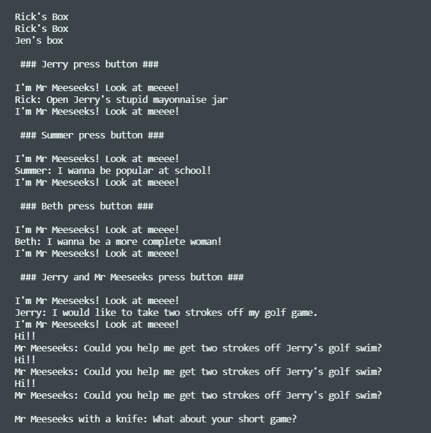

# Proxy Patter-MrMeeseek
This project is a task from the "DWEC" assignature. It's about to create an application using  the Proxy-pattern with JS and learn how to implement prototypes and how to test it, and obviously implement the main concepts of JS and even ES6.

 

## Tabla de Contenidos

1. [Tecnologías Usadas](#tecnologias-usadas)
1. [Historias de Usuarios](#historias-de-usuarios)
1. [Reflexiones](#reflexiones)
1. [Licencia](#licencia)

---

## Tecnologías Usadas

- JS
- NPM
- Visual Studio Code
- Git
- Jest

**[⬆ back to top](#tabla-de-contenidos)**

---

## Historias de Usuarios

**[⬆ back to top](#tabla-de-contenidos)**

---

## Reflexiones

This project let me to know how a basic JS project is created, managed and tested from the basis and the using of the main concepts.

**[⬆ back to top](#tabla-de-contenidos)**

---

## Licencia

MIT License

Copyright (c) 2021 Mateo Garcia Gonzalez

Permission is hereby granted, free of charge, to any person obtaining a copy of this software and associated documentation files (the "Software"), to deal in the Software without restriction, including without limitation the rights to use, copy, modify, merge, publish, distribute, sublicense, and/or sell copies of the Software, and to permit persons to whom the Software is furnished to do so, subject to the following conditions:

The above copyright notice and this permission notice shall be included in all copies or substantial portions of the Software.

**[⬆ back to top](#tabla-de-contenidos)**

---